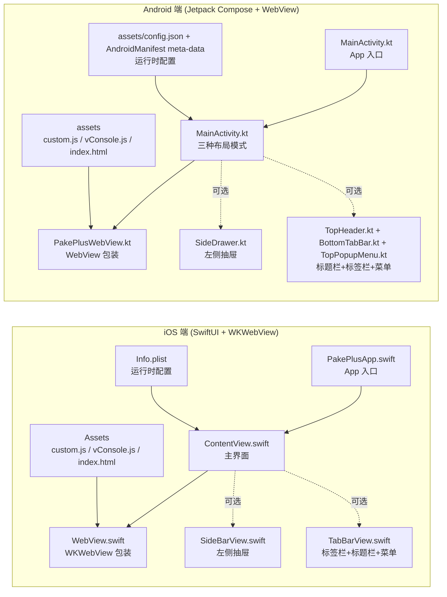

# PakePlus iOS 端与 Android 端功能对比图

## 一、架构对比

## 二、文件级功能对比

| iOS 文件 | Android 对应文件 | 核心职责 | 功能对齐度 |
|---|---|---|---|
| `PakePlus/PakePlusApp.swift` | `android/app/src/main/java/.../MainActivity.kt` | 应用入口与生命周期 | 100% |
| `PakePlus/ContentView.swift` | `MainActivity.kt` 简单模式 | 全屏 WebView + 启动图 + 状态控制 | 100% |
| `PakePlus/WebView.swift` | `PakePlusWebView.kt` | WebView 配置、JS 注入、下载、权限、手势 | 100% |
| `PakePlus/SideBarView.swift` | `ui/components/SideDrawer.kt` | 左侧抽屉菜单 | 100% |
| `PakePlus/TabBarView.swift` | `TopHeader.kt` + `BottomTabBar.kt` + `TopPopupMenu.kt` | 顶部标题栏、底部标签栏、右上角弹出菜单 | 100% |
| `PakePlus/Info.plist` | `assets/config.json` + `AndroidManifest.xml` meta-data | 运行时配置读取 | 100% |
| `PakePlus/custom.js` | `android/app/src/main/assets/custom.js` | 自定义 JS 注入 | 100% |
| `PakePlus/vConsole.js` | `android/app/src/main/assets/vConsole.js` | Debug 控制台注入 | 100% |
| `PakePlus/index.html` | `android/app/src/main/assets/index.html` | 本地 HTML 入口 | 100% |
| `scripts/www/pppwd.html` | `android/app/src/main/assets/index.html`（构建时复制） | 密码启动页 | 100% |
| `PakePlus.xcodeproj/project.pbxproj` | `android/app/build.gradle.kts` | 应用 ID、版本号、构建配置 | 100% |
| `Makefile` (Theos 打包) | `.github/workflows/build.yml` `build-android` job | IPA / APK 构建与产物上传 | 100% |

## 三、功能特性对比

### 3.1 WebView 核心能力

| 功能 | iOS (WKWebView) | Android (WebView) | 状态 |
|---|---|---|---|
| 加载远程 URL | `WKWebView.load(URLRequest)` | `WebView.loadUrl(url)` | 对齐 |
| 加载本地 HTML | `loadFileURL` / `WebViewAssetLoader` 同源 | `WebViewAssetLoader` `https://appassets.androidplatform.net/assets/` | 对齐 |
| JavaScript 启用 | `preferences.javaScriptEnabled = true` | `settings.javaScriptEnabled = true` | 对齐 |
| DOM Storage | `preferences.javaScriptEnabled` 隐含 | `settings.domStorageEnabled = true` | 对齐 |
| 文件访问限制 | `allowFileAccessFromFileURLs` 等 | `allowFileAccess=false`，通过 AssetLoader 安全访问 | 更严格 |
| 自定义 User-Agent | `customUserAgent` | `settings.userAgentString` | 对齐 |
| 禁用缩放 | viewport meta + `ignoresViewportScaleLimits` | viewport meta + `setSupportZoom(false)` | 对齐 |
| 内联/画中画媒体 | `allowsInlineMediaPlayback` / `allowsPictureInPictureMediaPlayback` | `mediaPlaybackRequiresUserGesture=false` | 对齐 |
| 开发者调试 | `isInspectable` / `developerExtrasEnabled` | `WebView.setWebContentsDebuggingEnabled(debug)` | 对齐 |
| 透明背景 | `isOpaque=false` + `backgroundColor=.clear` | `setBackgroundColor(TRANSPARENT)` + `isOpaque=false` | 对齐 |

### 3.2 JS 注入与桥接

| 功能 | iOS | Android | 状态 |
|---|---|---|---|
| 注入 viewport meta | `WKUserScript` | `evaluateJavascript` | 对齐 |
| 注入 custom.js | `WKUserScript` | `evaluateJavascript` | 对齐 |
| 注入 vConsole（debug） | `WKUserScript` | `evaluateJavascript` | 对齐 |
| Blob 下载桥 | `WKScriptMessageHandler` (`blobDownload`) | `@JavascriptInterface` (`AndroidBridge`) | 对齐 |
| 适配 iOS 风格调用 | 原生 `window.webkit.messageHandlers` | 注入 `window.webkit` 兼容层 | 兼容 iOS 风格 |

### 3.3 下载能力

| 功能 | iOS | Android | 状态 |
|---|---|---|---|
| 普通文件下载 | `URLSession` + `UIActivityViewController` | `DownloadManager` | 对齐 |
| Blob 分片下载 | JS Bridge 传输 Base64 分片 | JS Bridge 传输 Base64 分片 | 对齐 |
| Blob 保存位置 | 临时目录 + 分享面板 | `MediaStore.Downloads` / 公共 Downloads | 平台原生 |
| 下载提示 | 顶部 Toast "start downloading..." | `DownloadHint` 玻璃态 Toast | 对齐 |
| 下载完成提示 | 分享面板 | Toast "下载完成/失败" | 平台原生 |

### 3.4 权限处理

| 功能 | iOS | Android | 状态 |
|---|---|---|---|
| 相机/麦克风 | `WKUIDelegate.requestMediaCapturePermissionFor` | `WebChromeClient.onPermissionRequest` + `ActivityResultLauncher` | 对齐 |
| 定位 | `CLLocationManager` + `onGeolocationPermissionsShowPrompt` | `ActivityResultLauncher` + `GeolocationPermissions.Callback` | 对齐 |
| 运行时权限声明 | `Info.plist` | `AndroidManifest.xml` | 对齐 |

### 3.5 导航与手势

| 功能 | iOS | Android | 状态 |
|---|---|---|---|
| 返回/前进手势 | `UISwipeGestureRecognizer` | `GestureDetector.SimpleOnGestureListener` | 对齐 |
| 外部 scheme | `UIApplication.shared.open` | `Intent.ACTION_VIEW` | 对齐 |
| 白名单 scheme | `tel/mailto/sms/facetime` | `tel/mailto/sms/facetime` | 对齐 |

### 3.6 UI / UX / 主题

| 功能 | iOS (SwiftUI) | Android (Compose) | 状态 |
|---|---|---|---|
| 主题系统 | SwiftUI `.preferredColorScheme` / dynamic color | Material3 `PakePlusTheme` + dynamic color | 对齐 |
| 液态玻璃 | `Color.opacity` + `Material.ultraThinMaterial` | `LiquidGlassSurface` (`Modifier.blur` + 半透明) | 对齐 |
| 启动屏 | `LaunchScreen` storyboard / `Image` overlay | `core-splashscreen` + `LaunchOverlay` | 对齐 |
| 顶部标题栏 | SwiftUI `HStack` | Compose `TopAppBar` + `LiquidGlassSurface` | 对齐 |
| 底部标签栏 | SwiftUI `HStack` | Compose `NavigationBar` | 对齐 |
| 左侧抽屉 | SwiftUI 自定义 `SideBarView` | Compose `ModalNavigationDrawer` | 对齐 |
| 弹出菜单 | SwiftUI 自定义 VStack | Compose `DropdownMenu` | 对齐 |
| 字体/字号 | `.font(.title)` / `.caption` | `MaterialTheme.typography` 五级规范 | 对齐 |
| 全屏沉浸 | `.statusBarHidden(fullScreen)` | `WindowInsetsControllerCompat.hide` + edge-to-edge | 对齐 |
| 屏幕常亮 | `UIApplication.shared.isIdleTimerDisabled` | `FLAG_KEEP_SCREEN_ON` | 对齐 |

### 3.7 配置系统

| 配置项 | iOS | Android | 状态 |
|---|---|---|---|
| 目标 URL | `Info.plist` `WEBURL` | `assets/config.json` + `WEB_URL` meta-data | 对齐 |
| Debug 模式 | `Info.plist` `DEBUG` | `assets/config.json` + `DEBUG` meta-data | 对齐 |
| 全屏 | `Info.plist` `FULLSCREEN` | `assets/config.json` + `FULLSCREEN` meta-data | 对齐 |
| 启动图 | `Info.plist` `LAUNCHIMAGE` | `assets/config.json` + `LAUNCH_IMAGE` meta-data | 对齐 |
| 屏幕常亮 | `Info.plist` `SCREENON` | `assets/config.json` + `SCREEN_ON` meta-data | 对齐 |
| User-Agent | `Info.plist` `USERAGENT` | `assets/config.json` + `USER_AGENT` meta-data | 对齐 |
| 本地 HTML | `Info.plist` + 文件复制 | `assets/config.json` + `IS_HTML` meta-data + AssetLoader | 对齐 |
| SafeArea | 修改 `ContentView.swift` edges | `phone.safeArea` padding | 对齐 |
| Header 配置 | `ppconfig.phone.header`（未在 iOS 使用） | `phone.header` 驱动 `TopHeader` | Android 已支持 |
| SiderMenu 配置 | `ppconfig.phone.siderMenu`（未在 iOS 使用） | `phone.siderMenu` 驱动 `SideDrawer` | Android 已支持 |
| TabBar 配置 | `ppconfig.phone.tabBar`（未在 iOS 使用） | `phone.tabBar` 驱动 `BottomTabBar` | Android 已支持 |
| WebView 详细配置 | `ppconfig.phone.webview`（未在 iOS 使用） | `phone.webview` 驱动 `WebSettings` | Android 已支持 |

### 3.8 构建与发布

| 能力 | iOS | Android | 状态 |
|---|---|---|---|
| 本地构建 | Xcode / Theos `make package` | `gradle assembleDebug` | 对齐 |
| CI 构建 | `.github/workflows/build.yml` Tauri 矩阵 | `.github/workflows/build.yml` `build-android` job | 对齐 |
| 配置注入脚本 | `scripts/ppworker.cjs`（iOS 部分） | `scripts/ppworker.cjs`（新增 Android 部分） | 对齐 |
| 应用 ID / Bundle ID | `PRODUCT_BUNDLE_IDENTIFIER` | `applicationId` | 对齐 |
| 版本号 | `CFBundleShortVersionString` | `versionName` | 对齐 |
| 产物上传 | GitHub Release / Artifacts | GitHub Artifacts APK | 对齐 |

## 四、测试对比

| 测试类型 | iOS | Android | 状态 |
|---|---|---|---|
| 单元测试 | 无（当前仓库） | Robolectric `ConfigParserTest.kt` | Android 更完善 |
| 集成测试 | 无（当前仓库） | Espresso `WebViewSmokeTest.kt` | Android 更完善 |

## 五、差异与注意事项

| 差异点 | 说明 |
|---|---|
| **Gradle Wrapper** | Android 当前使用系统 Gradle 回退脚本，需运行 `gradle wrapper --gradle-version 8.7` 生成完整 wrapper。 |
| **图标生成** | iOS 使用 `appicon` 生成完整 `AppIcon.appiconset`；Android mipmap 为占位图，需按 `ppconfig.android.icon` 生成多密度图标。 |
| **后台音频** | iOS 声明 `UIBackgroundModes` audio；Android 若需后台播放需额外 `Foreground Service`。 |
| **下载保存位置** | iOS 通过分享面板让用户选择；Android 直接写入系统 `Downloads` 目录。 |
| **配置复杂度** | iOS 仅使用 `Info.plist` 少量字段；Android 使用 `assets/config.json` 承载完整 `phone`/`android` 配置，更利于扩展。 |
| **标签栏菜单项** | iOS `TabBarView.swift` 硬编码 3 个 URL；Android 支持 `ppconfig.phone.tabBar.tabBarItem` 动态配置。 |
